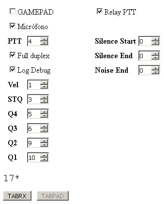

# DTMF CHAT
Sending of SMS's under DTMF tones, with real-time decoding using microphone or gamepad (MT8870 connected to joystick), under HTML5.

 
<ul>
 <li><a href='#interface'>Interface<a/></li>
 <Href='#arduino'>ARDUINO HID<a/></li>  
 <Href='#html5'>HTML5<a/></li>
 <Options
 <Code
 <Project status
</ul>
 

<a name="interface"><h2>Interface</h2><a>
Several interfaces are allowed:
<ul>
 <Microphone or line input
 <Line or speaker output
 <Joystick or gamepad modified with MT8870
 <Arduino emulating joystick (ARDUINO UNO)
</ul>
Although using the MT8870 involves a little more difficulty, much more speed and accuracy is achieved in decoding DTMF tones.
Thanks to the MT8870 chip, connecting the STQ, Q4, Q3, Q2 and Q1 outputs to a transistor allows you to open or close
the buttons on a GAMEPAD, you can decode DTMF tones. We only need 5 pins (control buttons).

We will have to locate with multimeter the 5V of power supply of the USB of the control, to be able to feed the MT8870, as well as the mass in common.

In this example, the control, we have chosen the following buttons, but they can vary, and we will have to take it into account in the application:
<ul>
 <(button 3)
 <Q4 (button 5)
 <li>>Q3</b> (button 6)</li>
 <Q2</b> (button 9)</li>
 <Q1</b> (button 10)</li>
</ul>
  

<a name="arduino"><h2>ARDUINO HID</h2></a>
If you have an Arduino one R3 ATMEGA328 board with the ATMEGA 16u2 communications chip, you can use the modified big_joystick_dtmf code to emulate a 40 button HID joystick, which is activated by the MT8870 signals we have connected to the pins:

<ul>
 <li>stq - 2</li>
 <li>q4 - 3</li>
 <li>q3 - 4</li>
 <li>q2 - 5</li>
 <li>q1 - 6</li>
</ul> 

The buttons on the remote are:
<ul>
 <li>stq - 3</li>
 <li>q4 - 5</li>
 <li>q3 - 6</li>
 <li>q2 - 9</li>
 <li>q1 - 10</li>
</ul>

It is required to flash the ATMEGA16u2 chip with:

<a href='https://github.com/harlequin-tech/arduino-usb'>https://github.com/harlequin-tech/arduino-usb</a>

Use the FLIP tool and put the chip in DFU mode.
If we want other buttons, we will have to modify the ARDUINO code:
<pre><code>
#define pad_stq 2 // subtract 1
#define pad_q4 4
#define pad_q3 5
#define pad_q2 8
#define pad_q1 9
</code></pre>
It has been forced by code changes in the AXES to make it equivalent to a button pressed, so that browsers detect it in the HTML5, and there is no need to press any button, since being an emulator with ARDUINO, it would be difficult to simulate.

  
<a name="html5"><h2>HTML5</h2></a>
HTML5 (js) has been chosen to achieve maximum portability. The current interface is not the definitive one, since something simple has been used for functionality tests. 
In HTML5 there are certain permission problems, both in the use of the microphone, as the GAMEPAD, which are solved differently, depending on browser and device. 
A typical problem with the gamepad is that you have to connect by usb and disconnect every time you have to use it or even that you have to press a button on the gamepad to accept permission on the first initialization. 
For the microphone, you need to give permission to use the microphone input.
We must adjust both the output and input levels, so that the tones are well detected.

  
<a name="options"><h2>Options</h2><a>

If we select the TabPAD button, we can access all the options:
<ul>
 <Gamepad (reads DTMF tones from gamepad)
 <Microphone (reads DTMF tones from microphone or line input)
 <PTT (D-tone number sent to activate VOX)
 <Full Duplex (Allows decoding while sending)</li>
 <Log Debug
 <Speed (DTMF sending speed)</li>
 <STQ (PAD button for MT8870 STQ pin)
 <Q4 (PAD button for MT8870 pin Q4)
 <Q3 (PAD button for MT8870 pin Q3)
 <Q2 (PAD button for MT8870 pin Q2)
 <Q1 (PAD button for MT8870 pin Q1) 
</ul>
You can have the Gamepad and Microphone active at the same time to be able to decode both sites at the same time, but the normal thing is to have only one active site (the one we are going to use). 
The PTT is equivalent to sending the 'D' tone as many times as specified. This will allow you to open the VOX of a talkie.
The fullduplex is useful for testing, since it allows us a kind of ECO, if we make a shipment to see in the equipment itself 

Translated with www.DeepL.com/Translator (free version)
