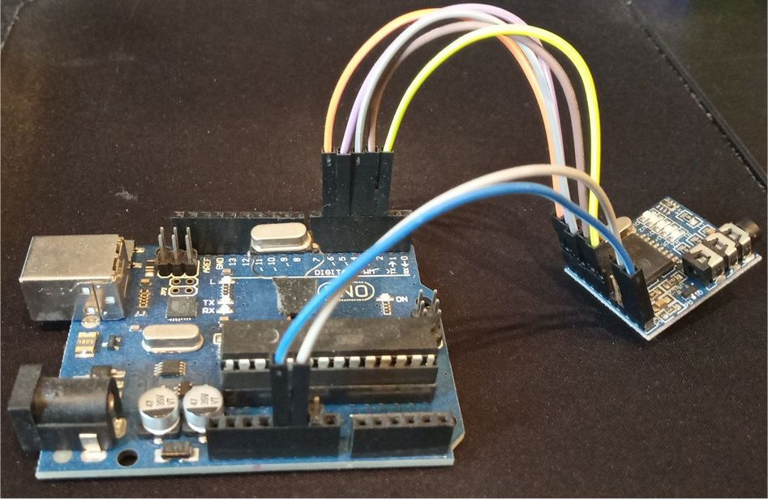
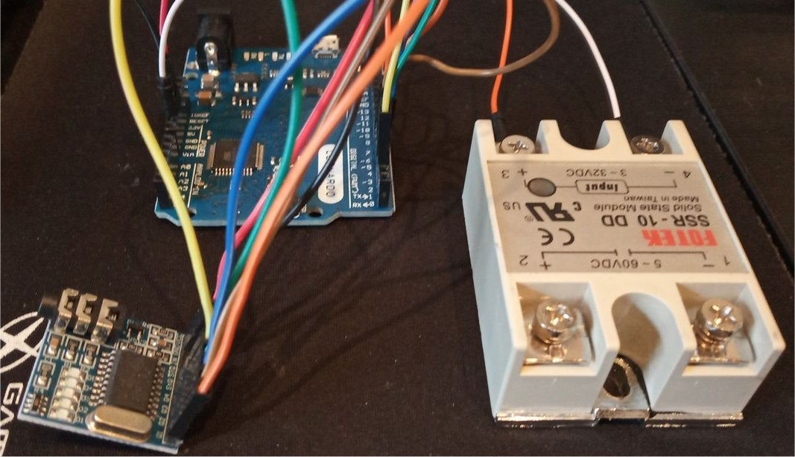
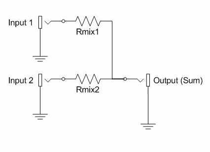

# CHAT DTMF
Envio de SMS's bajo tonos DTMF, con decodificación en tiempo real usando micrófono o gamepad (MT8870 conectado a joystick), bajo HTML5.

 
<ul>
 <li><a href='#interface'>Interface<a/></li>
 <li><a href='#arduino'>ARDUINO UNO HID<a/></li>  
 <li><a href='#leonardo'>ARDUINO LEONARDO HID<a/></li>
 <li><a href='#rele'>Relé PTT<a/></li>  
 <li><a href='#html5'>HTML5<a/></li>
 <li><a href='#opciones'>Opciones<a/></li>
 <li><a href='#codigo'>Código</a></li>
 <li><a href='#estado'>Estado del proyecto<a/></li>
</ul>
 

<a name="interface"><h2>Interface</h2></a>
Se permiten varios interfaces:
<ul>
 <li>Micrófono o entrada de linea</li>
 <li>Salida de linea o altavoces</li>
 <li>Joystick o gamepad modificado con MT8870</li>
 <li>Arduino emulando joystick (ARDUINO UNO R3 ATMEGA 16u2 y LEONARDO)</li>
</ul>
Aunque el uso del MT8870 implica un poco más de dificultad, se consigue mucha más velocidad y precisión a la hora de decodificar tonos DTMF.
Gracias al chip MT8870, conectando las salidas de STQ, Q4, Q3, Q2 y Q1 a un transistor permitiendo abrir o cerrar
los botones de un GAMEPAD, se puede decodificar tonos DTMF. Tan sólo necesitamos 5 pines (botones de mando).

Tendremos que localizar con multímetro los 5V de alimentación del USB del mando, para poder alimentar el MT8870, así como la masa en común.

En este ejemplo, el mando, se ha optado por los siguientes botones, pero pueden variar, y tendremos que tenerlo en cuenta en la aplicación:
<ul>
 <li><b>STQ</b> (botón 3)</li>
 <li><b>Q4</b> (botón 5)</li>
 <li><b>Q3</b> (botón 6)</li>
 <li><b>Q2</b> (botón 9)</li>
 <li><b>Q1</b> (botón 10)</li>
</ul>
  

<a name="arduino"><h2>ARDUINO UNO HID</h2></a>
Si se dispone de una placa Arduino uno R3 ATMEGA328 con el chip de comunicaciones ATMEGA 16u2, se puede hacer uso del código modificado big_joystick_dtmf para poder emular un joystick de 40 botones HID, que se activan por las señales del MT8870 que hemos conectado a los pines:

<ul>
 <li>stq - 2</li>
 <li>q4 - 3</li>
 <li>q3 - 4</li>
 <li>q2 - 5</li>
 <li>q1 - 6</li>
 <li>Relé - 7</li>
</ul> 

Los botones del mando son:
<ul>
 <li>stq - 3</li>
 <li>q4 - 5</li>
 <li>q3 - 6</li>
 <li>q2 - 9</li>
 <li>q1 - 10</li>
 <li>Flip flop - 11 (botón oscilante para no tener que apretar un botón desde el navegador)</li>
 <li>Relé PTT - 12 (botón que indica cuando se activa el Rele externo)</li>
</ul>

Se requiere previamente flashear el chip ATMEGA16u2 con:

<a href='https://github.com/harlequin-tech/arduino-usb'>https://github.com/harlequin-tech/arduino-usb</a>

Se debe usar la herramienta FLIP y poner el chip en modo DFU. 
Si queremos otros botones, deberemos modificar el código de ARDUINO:
<pre><code>
#define pad_stq 2 //Le restamos 1
#define pad_q4 4
#define pad_q3 5
#define pad_q2 8
#define pad_q1 9
#define pad_switchFlip 10 //boton flipflop pulsado para activar navegador
#define pad_relay 11 //boton indicando rele

//Delay milliseconds
#define time_delay 100
//Maximo tiempo rele activo Timeout milisegundos 120 segundos (2 minutos) * 1000 ms = 120000 ms
#define time_out_relay 120000
//Tiempo maximo de silencio milisegundos 1 segundo 1000 ms
#define time_silence 1000
</code></pre>
Se ha forzado por código cambios flip flop del botón 10 para que equivalga a un boton presionado, para que así los navegadores lo detecten en el HTML5, y no haya que pulsar ningún boton, dado que al ser un emulador con ARDUINO, seria dificil de simular.
  

<a name="leonardo"><h2>LEONARDO HID</h2></a>
Si se dispone de una placa Leonardo, siguiendo mismo esquema de botones, y filosofia del Arduino UNO, pero con el código del Leonardo, se puede también emular un joystick.
Se ha usado las librerías: 
<a href="https://github.com/MHeironimus/ArduinoJoystickLibrary">https://github.com/MHeironimus/ArduinoJoystickLibrary</a>
  

<a name="rele"><h2>Relé PTT</h2></a>
Desde Arduino UNO y LEONARDO se ha añadido la opción de usar el pin 7 como salida para activar el PTT:

<ul>
 <li>Relé sólido</li>
 <li>Relé con trigger en lógica LOW (cambiar por código)</li>
 <li>Relé con trigger en lógica HIGH (cambiar por código)</li> 
</ul>

Cuando recibimos un tono DTMF C, se activará el relé. Se ha puesto por código un timeout máximo de transmisión de 2 minutos, así como una detección de silencio de 1 segundo. Si se excede ese tiempo, se cerrará el PTT.
Debemos mezclar la entrada del módulo MT8870 que decodifica tonos DTMF del aire o radio, y la salida de nuestro dispositivo (tarjeta sonido) que genera el tono C para activar el PTT. Se puede usar un mezclador de audio o la mezcla de disposivos de grabación. También podemos usar un circuito básico de mezcla pasiva:

De esta forma, tenemos que mezclar la salida de audio de nuestro talkie, con la salida de la tarjeta de sonido, para luego pasar dicha mezcla por la única entrada del módulo del MT8870.
El circuito es muy simple y el valor de la resistencia debe ser entre 1K y 10K.
  

<a name="html5"><h2>HTML5</h2></a>
Se ha optado por HTML5 (js) para poder conseguir la máxima portabilidad. El interface actual no es el definitivo, dado que se ha usado algo simple para pruebas de funcionalidad. 
En HTML5 existen ciertos problemas de permisos, tanto en el uso del micrófono, como el GAMEPAD, que se solucionan de diferente manera, según navegador y dispositivo. 
Un problema típico en el gamepad, es que se tenga que conectar por usb y desconectar cada vez que se tenga que usar o incluso que se tenga que pulsar un botón del gamepad para aceptar permiso en la primera inicialización. 
Para el micrófono, se necesita darle el permiso de usar la entrada del mismo. 
Debemos ajustar los niveles tanto de salida como de entrada, para que se detecten bien los tonos. 
La posibilidad de de usar un dispositivo HID nos permite no depender de permisos especiales, y nos da más portabilidad. Así mismo, con el truco del mezclador de audio y el ARDUINO, se puede activar un relé sin falta de puerto serie, dandonos la posibilidad de usarlo en transceptores que no disponen de VOX.
 
A la hora de enviar mensajes, podemos elegir:
<ul>
 <li>0 Sin compresión<li>
 <li>1 Diccionario Español - Reduce a mayúsculas y con un mini diccionario<li>
 <li>2 LZW - Comprime en LZW<li>
 <li>Auto - Selecciona el modo que menos ocupa en espacio para enviar<li>
</ul>

  
<a name="opciones"><h2>Opciones</h2></a>

Si seleccionamos el botón de TabPAD, podremos acceder a todas las opciones:
<ul>
 <li>Gamepad (lee tonos DTMF desde gamepad)</li>
 <li>Micrófono (lee tonos DTMF desde micrófono o entrada de linea)</li>
 <li>PTT (Número de tono D que se envia para activar VOX)</li>
 <li>Fullduplex (Permite decodificar al mismo tiempo que envia)</li>
 <li>Log Debug (saca un log por consola)</li>
 <li>Vel (Velocidad de envio DTMF)</li>
 <li>STQ (botón del PAD para pin STQ del MT8870)</li>
 <li>Q4 (botón del PAD para pin Q4 del MT8870)</li>
 <li>Q3 (botón del PAD para pin Q3 del MT8870)</li>
 <li>Q2 (botón del PAD para pin Q2 del MT8870)</li>
 <li>Q1 (botón del PAD para pin Q1 del MT8870)</li>
 <li>Relay PTT (activa un relé con el tono DTMF C)</li>
 <li>Silence Start (Añade un silencio al activar PTT)</li>
 <li>Silence End (Añade un silencio al finalizar PTT)</li>
 <li>Noise End (Añade ruido tono DTMF D al finalizar PTT)</li>
</ul>
Se puede tener al mismo tiempo activo el Gamepad y Micrófono para poder decodificar al mismo tiempo de ambos sitios, pero lo normal es tener sólo uno activo (el que vayamos a usar). 
El PTT equivale a enviar la tono 'D' tantas veces como este especificado. De esta forma, permitirá abrir el VOX de un talkie. 
El fullduplex es útil para test, ya que nos permite una especie de ECO, si hacemos un envio para ver en el propio equipo lo que se recibe, pero lo normal es tenerlo desactivado mientras se transmite.
  

<a name="codigo"><h2>Código</h2></a>
Si seleccionamos el código del <b>sketch.js</b> podremos modificar ciertas variables, que son las opciones, para así aplicarlas directamente, sin falta de hacerlas desde la aplicación:
<pre><code>
 //Configuraciones
 var gb_cadPTT = 'DDDD';        //Activar PTT VOX numero de tono D a repetir
 var gb_cadSilenceStart = ''    //Silencio despues de PTT (numero de veces a repetir)
 var gb_cadSilenceEnd = ''      //Silencio antes de finalizar PTT (numero de veces a repetir)
 var gb_cadNoiseEnd = ''        //Ruido antes de finalizar PTT (numero de veces a repetir)
 var gb_log_debug = true;       //Sacamos log de RX y TX true o false
 var gb_fullduplex = true;      //RX y TX al mismo tiempo true o false
 var gb_use_gamepad_dtmf= false //Permite lectura de gamepad MT8870 true o false
 var gb_use_mic_dtmf= true;     //Permite lectura de microfono true o false
 var gb_id_stq = 3;             //Boton PAD para pin STQ MT8870
 var gb_id_q4 = 5;              //Boton PAD para pin Q4 MT8870
 var gb_id_q3 = 6;              //Boton PAD para pin Q3 MT8870
 var gb_id_q2 = 9;              //Boton PAD para pin Q2 MT8870
 var gb_id_q1 = 10;             //Boton PAD para pin Q1 MT8870
 var gb_speed_dtmf = 1;         //Velocidad envio tonos 1 .. 9 (Solo MT8870)
 var gb_use_sms = 3;            //Compresion SMS 0(crudo),1(diccionario mayusculas),2(LZW),3(auto)
 var gb_use_relay = true;       //Rele Arduino activado por tono DTMF C
</code></pre>
  

<a name="estado"><h2>Estado del proyecto</h2></a>
<ul>
 <li>Fase 1 - Simple Chat</li>
 <li>Fase 2 - Aumento de servicios (en desarrollo)</li>
 <li>Fase 3 - Aumento de velocidad (en desarrollo)</li>
 <li>Fase 4 - Enlaces (en desarrollo)</li>
</ul>
